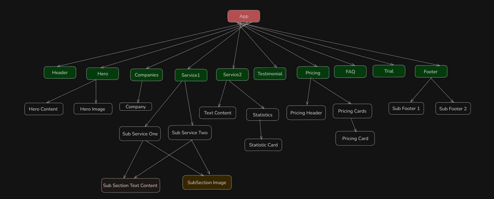

# Building digital products & brands.

This is a digital products & brands service website template build on ReactJS + Vite, TailwindCSS, FlowbiteUI Library with following the best approaches of frontend development.

## Frontend Architecture (Tree)



## Steps to Setup

#### Clone The Repository

```bash
  git clone git@github.com:Learn-with-Sumit/batch-3-assignment-1-agency-landing-page-mr-jubayer.git
```

```bash
  cd batch-3-assignment-1-agency-landing-page-mr-jubayer
```

#### Install Dependency

```bash
 npm Install
```

#### Then run in development

```bash
 npm run dev
```

### Live Link: https://agency-landing-page-beta-six.vercel.app
